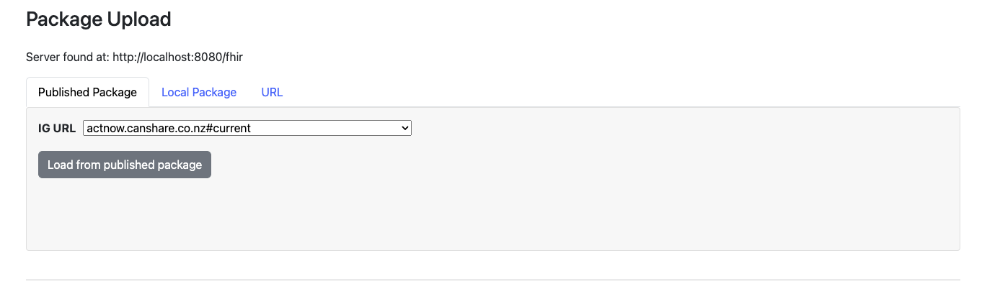

# UNICOM-test-lab

This is a set of artifacts to facilitate testing and experimenting with IDMP-compatible data exchange using HL7 FHIR (Release 5).
This test lab consists of

## Features

* Standalone FHIR R5 server, prepacked with the necessary content
* IDMP medicinal product browser, including:
  * IDMP medicinal product visualizer
  * Validator
* Server management page, for uploading new content
* Data generation auxilliary functions

## Usage

### Starting up
1. install docker
2. download (clone) this repository (`git clone https://github.com/unicom-project-eu/UNICOM-test-lab.git` )
3. inside the folder run ```docker-compose up -d``` for a simple instance
4. inside the folder run ```docker-compose -f docker-compose-bd.yml up -d``` for a more robust and feature-rich instance
5. access the homepage in localhost:8080


### Adding Data
1. click on the product browser tab to access the product browser/viewer
   1. In this page, click the wrench tool to access sever management:
2. In the server management, you can have 3 ways of adding data, like the image below:
    

   1. **"Published Package"** is a dropdown of all packages in the [registry page](http://fhir.org/guides/registry/)
   2. **"Local Package"** is for uploading your own package from file system to the server
   3. **"URL"** is for providing a link for a package on the web and upload its data to the server
   > Currently you can only add data with "Published Package" option. IDMP-compatible data created by UNICOM WP4 is available for manual uploading - see section below "existing data".
   
3. With option 1) **"Published Package"**, you can select the package from the dropdown (i.e. unicom-ig), 
4. Then click "Upload package resources to server"
5. You can go back to the product browser and visualize the products.


### Product Browser

1. ID is the resource ID (MP)
2. Name is the MP name
3. Country is the country of MP
4. Viewer:
   1. link for built-in viz (viewer)
   2. link for external viz (Ext. Viewer)
5. Source - the data (bundle with all) in JSON and XML
6. Validation - The report of the validation of resource 

### Existing Data

1. [UFIS (Swedish and Estonian) data](https://github.com/unicom-project-eu/unicom-tools/tree/main/ufis/ufis-fhir/input/fsh)
2. [Portugal Data](https://github.com/unicom-project-eu/unicom-tools/tree/main/pt-PPLCreator/fhir-data/input/fsh/pt)

## Reporting Issues

Please use the issue tracker in this repository to ask questions, provide feedback and/or ask for help
[link](https://github.com/unicom-project-eu/UNICOM-test-lab/issues)

